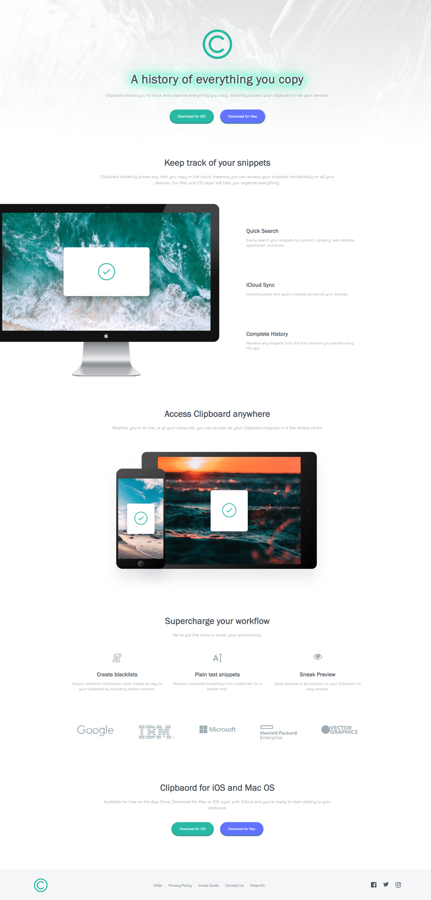

# Frontend Mentor - Clipboard landing page solution

This is a solution to the [Clipboard landing page challenge on Frontend Mentor](https://www.frontendmentor.io/challenges/clipboard-landing-page-5cc9bccd6c4c91111378ecb9). Frontend Mentor challenges help you improve your coding skills by building realistic projects. 

## Table of contents

- [Overview](#overview)
  - [Screenshot](#screenshot)
  - [Links](#links)
- [My process](#my-process)
  - [Built with](#built-with)
  - [Useful resources](#useful-resources)
- [Author](#author)

## Overview

### Screenshot

### Links

- Solution URL: [https://www.frontendmentor.io/solutions/clipboardlandingpage-Q2Rnqp6VU]
- Live Site URL: [https://jiale456.github.io/clipboard-landing-page-master/]

## My process

### Built with

- HTML5
- CSS3
- SCSS
- Mobile-first workflow

### Useful resources

- [How to Create Neon Text With CSS](https://css-tricks.com/how-to-create-neon-text-with-css/) - This helped me for XYZ reason. I really liked this pattern and will use it going forward.

## Author

- Frontend Mentor - [@jiale456](https://www.frontendmentor.io/profile/jiale456)
